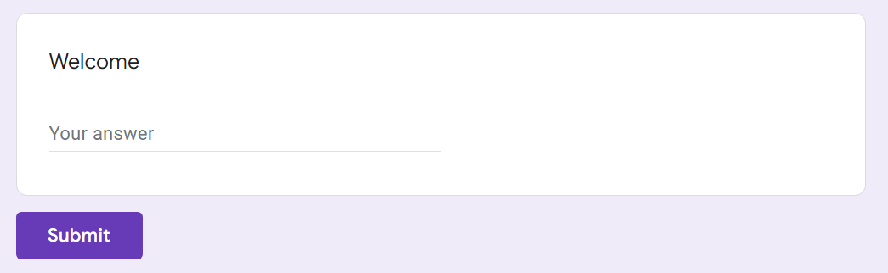

# Welcome

> Join our discord server @ https://discord.gg/d9wbXEP2wN
>
> The flag is in #rules

### Just why would I do this?

BECAUSE Y'ALL ASKED FOR IT IN THE GOOGLE FORMS LOLOLOL I NEED HELP :)()()()

---

### Analysis of Website URL

First, the description requested me to join the discord server. Before I clicked the link, I was afraid it was malicious, so I utilized https://safeweb.norton.com to check whether the website was safe.

As shown by the picture above, the website was in fact, safe! Thus, I utilized the clicked the link using my left mouse button, redirecting me to the discord website.

### #Rules

Next, the challenge description mentioned that the flag is in **#Rules**. Thus, I navigated to the channel, which greeted me with a message from `@mechfrog88`. Using the keyboard shortcut `CTRL + F`, I managed to find 3 possible flags which are highlighted in the picture below.

With my top-notch skills, I deduced that the flag was `grey{1_h4v4_read_da_rule_and_4gr33}` since it uses leetspeak, which many CTF flags include.

### Conclusion

This challenge was extremely time-consuming, taking about 1 minute and 10 seconds of my lifespan. However, with great grit, I managed to persevere, using `CTRL + C` & `CTRL + V` to copy the flag from discord to the CTFd platform.

10/10 would copy and paste again :)